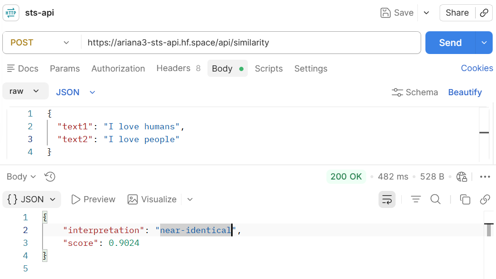

# STS API - Semantic Text Similarity & Plagiarism Detection

A Flask-based REST API for semantic text analysis using Sentence Transformers. The API provides semantic similarity scoring, pairwise similarity analysis, text clustering, and plagiarism detection capabilities.

## Features

* Semantic Text Similarity
* Pairwise Similarity Analysis
* Text Clustering
* Plagiarism Detection
* RESTful API Design
* Hugging Face Deployment Support

## Tech Stack

* Python
* Flask
* Sentence Transformers
* Scikit-learn
* NumPy
* SciPy

## Deployment

- Hugging Face Space: https://huggingface.co/spaces/ariana3/sts-api
- Live API: https://ariana3-sts-api.hf.space

## API Endpoints

### Health Check

**GET** `/health`

Response:

```json
{
  "status": "ok"
}
```

---

### Semantic Similarity

**POST** `/api/similarity`

Request:

```json
{
  "text1": "I love machine learning",
  "text2": "I enjoy artificial intelligence"
}
```

Response:

```json
{
  "score": 0.82,
  "interpretation": "highly similar"
}
```

---

#### Postman Test




### Text Clustering

**POST** `/api/cluster`

Request:

```json
{
  "texts": [
    "Machine learning is useful",
    "Artificial intelligence is transforming industries",
    "Football is a popular sport",
    "Cricket is widely played"
  ],
  "n_clusters": 2
}
```

Response:

```json
{
    "assignments": [
        0,
        0,
        1,
        1
    ],
    "clusters": {
        "0": [
            {
                "index": 0,
                "text": "Machine learning is useful"
            },
            {
                "index": 1,
                "text": "Artificial intelligence is transforming industries"
            }
        ],
        "1": [
            {
                "index": 2,
                "text": "Football is a popular sport"
            },
            {
                "index": 3,
                "text": "Cricket is widely played"
            }
        ]
    },
    "n_clusters": 2
}

```

---

### Plagiarism Detection

**POST** `/api/plagiarism`

Request:

```json
{
  "source": "Machine learning is transforming technology.",
  "candidates": [
    "Machine learning is changing technology.",
    "I like playing football."
  ],
  "threshold": 0.75
}
```

Response:

```json
{
    "flagged_count": 1,
    "results": [
        {
            "candidate_index": 0,
            "flagged": true,
            "similarity_score": 0.9138,
            "text": "Machine learning is changing technology."
        },
        {
            "candidate_index": 1,
            "flagged": false,
            "similarity_score": 0.0357,
            "text": "I like playing football."
        }
    ],
    "threshold": 0.75,
    "total_candidates": 2
}

```

## Installation

Clone the repository:

```bash
git clone <repository-url>
cd sts-api
```

Create a virtual environment:

```bash
python -m venv venv
```

Activate the environment:

### Windows

```bash
venv\Scripts\activate
```

### Linux / macOS

```bash
source venv/bin/activate
```

Install dependencies:

```bash
pip install -r requirements.txt
```

Run the application:

```bash
python app.py
```

The API will start on:

```text
http://localhost:7860
```

## Project Structure

```text
sts-api/
│
├── app.py
├── requirements.txt
├── services/
│   ├── similarity.py
│   ├── clustering.py
│   └── plagiarism.py
│
└── README.md
```

## Example Use Cases

* Resume Screening
* Assignment Similarity Checking
* Duplicate Content Detection
* Document Clustering
* Semantic Search Systems
* NLP Research Projects

## Future Enhancements

* Swagger/OpenAPI Documentation
* Authentication & API Keys
* Batch Processing Support
* Docker Compose Deployment
* Frontend Dashboard
* Rate Limiting

## Author

Ariana Rahman

Built using Flask and Sentence Transformers.
